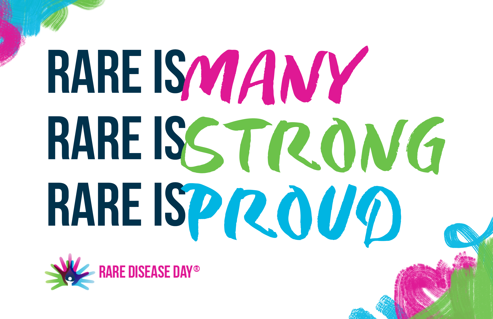

The Phenogenomics group at WHRI-QMUL is a small computational team with **many** collaborators.  

The Phenogenomics group at WHRI-QMUL has a **strong** will to contribute to Rare Disease research.  

The Phenogenomics group at WHRI-QMUL is **proud** of the impact their work can have on the life of patients and families affected by rare disorders.

### Our Projects
- We have built Exomiser, **one of the most popular software frameworks for diagnosis of rare disease patients**, together with our collaborators in the Monarch Initative
- We have been playing a leading role in [**discovering new rare disease genes**](https://www.nejm.org/doi/full/10.1056/NEJMoa2035790) within the analysis of genomic data from the UK 100,000 Genomes Project
- We have been reviewing the most up-to-date variant prioritisation software - a type of software that can speed up the **genetic diagnosis** of rare diseases
- We have been integrating cross-species data to elucidate the [**full spectrum of intolerance to Loss-of-Function variation**](https://www.nature.com/articles/s41467-020-14284-2) developing novel disease-gene discovery and variant prioritisation strategies tailored to specific type of disorders.

### Our Collaborators
- [The 100,000 Genomes Project](https://www.genomicsengland.co.uk/initiatives/100000-genomes-project)
- [The Monarch Initiative](https://monarchinitiative.org/)
- [The Human Phenotype Ontology](https://hpo.jax.org/app/)
- [The International Mouse Phenotyping Consortium](https://www.mousephenotype.org/)

We are part of the [Centre for Translational Bioinformatics](https://www.qmul.ac.uk/c4tb/our-team/) and the [Digital Environment Research Institute](https://www.qmul.ac.uk/deri/)
